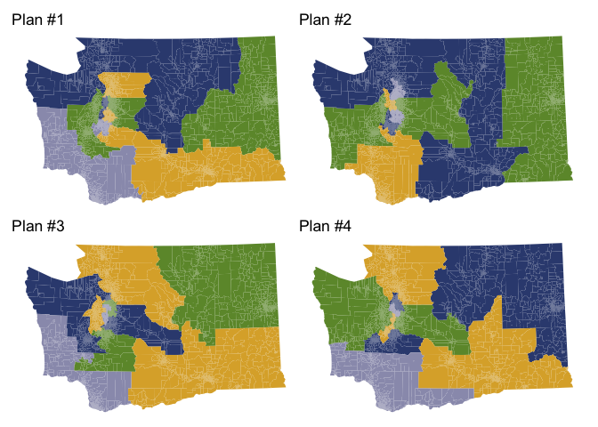
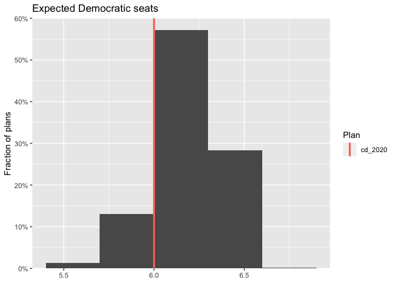

<!-- README.md is generated from README.Rmd. Please edit that file -->

# alarmdata <a href="https://alarm-redist.org/alarmdata/"></a>

<!-- badges: start -->

[](https://github.com/alarm-redist/alarmdata/actions)
<!-- badges: end -->

**alarmdata** provides utility functions to download and process data
produced by the ALARM Project, including [2020 redistricting
files](https://alarm-redist.org/posts/2021-08-10-census-2020/) and
[50-State Redistricting
Simulations](https://doi.org/10.7910/DVN/SLCD3E).

## Installation

You can install **alarmdata** with:

``` r
install.packages("alarmdata")
```

You can also install the development version from
[GitHub](https://github.com/) with:

``` r
# install.packages("remotes")
remotes::install_github("alarm-redist/alarmdata")
```

## Example

We can easily download simulation data for a state and make some plots.

``` r
library(alarmdata)
library(redist)

map_wa = alarm_50state_map("WA")
plans_wa = alarm_50state_plans("WA")

redist.plot.plans(plans_wa, draws=1:4, shp=map_wa)
```



``` r

hist(plans_wa, e_dem) +
    ggplot2::labs(x=NULL, title="Expected Democratic seats")
```



Downloads will go to `options(alarm.cache_dir)` if it is set. If it is
not, and `options(alarm.use_cache = TRUE)`, downloads will be cached
between sessions in `rappdirs::user_cache_dir("alarm")`. If If
`options(alarm.use_cache = FALSE)` (the default), then the cache will be
in a temporary directory that does not persist between sessions. You can
check the size of the cache and clear it with `alarm_cache_size()` and
`alarm_cache_clear()`.
